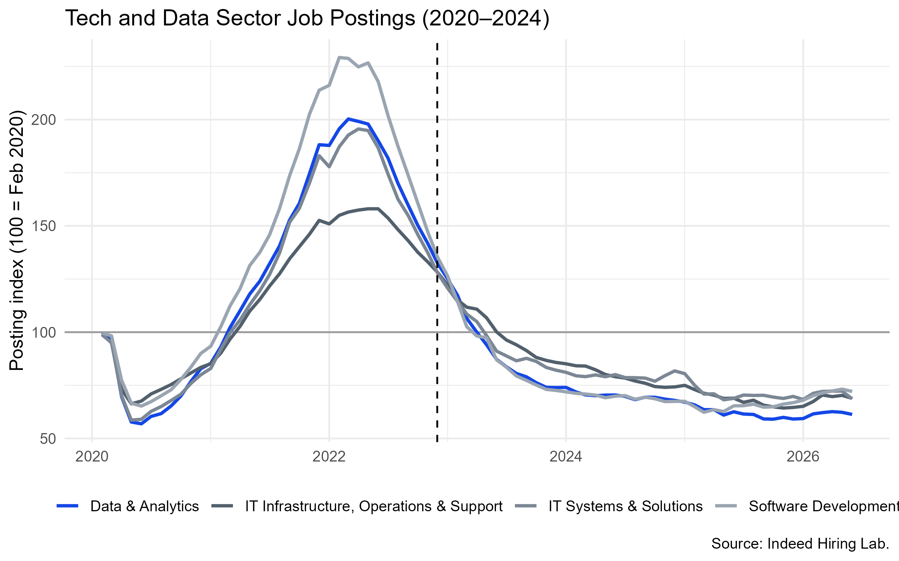
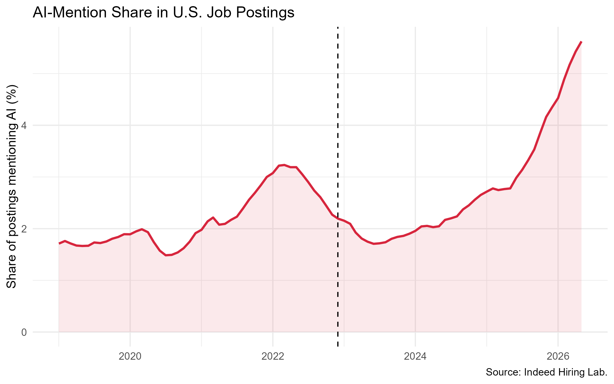
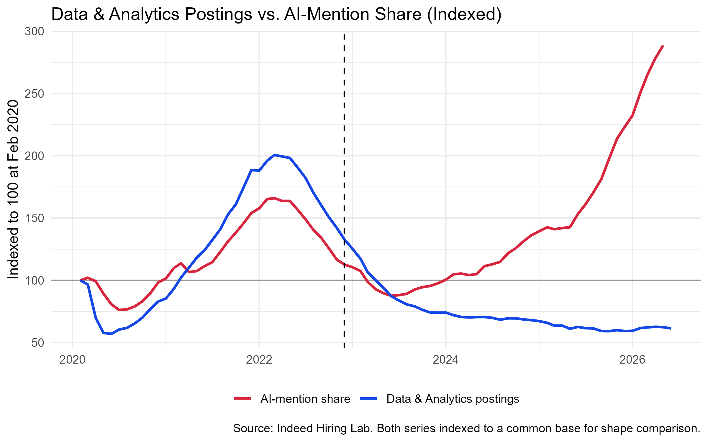
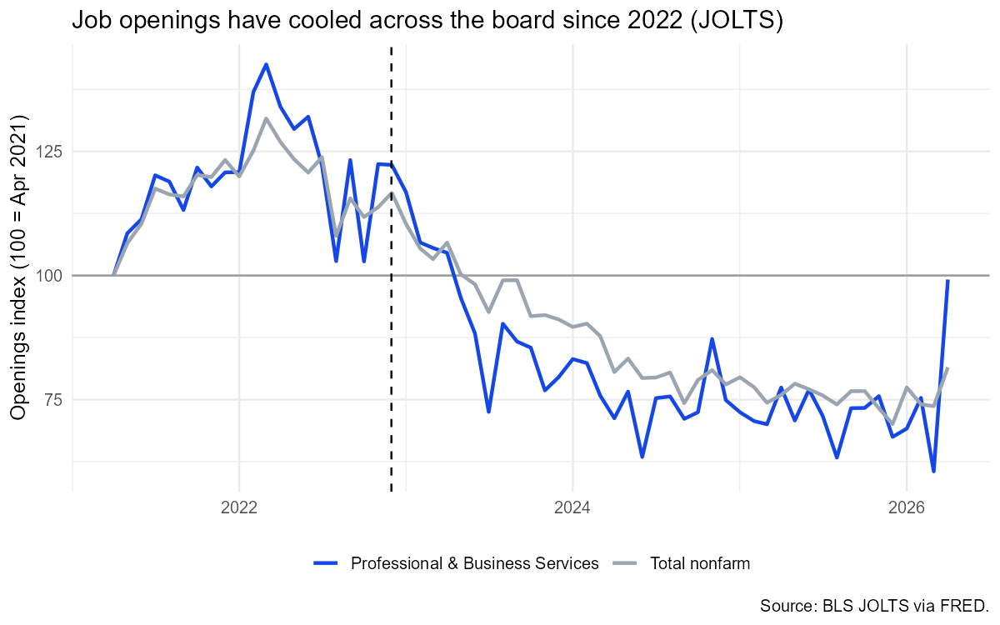

## Data Selection

My project utilizes four public datasets that were chosen to measure two things: the demand for data-related jobs in the U.S. and the AI signals that might predict that demand.

The first two datasets are from the U.S. Bureau of Labor Statistics (BLS) Job Openings and Labor Turnover Survey (JOLTS) and measure the total number of job openings in the U.S. and the number of job openings in Professional and Business Services, respectively, which narrows openings down to data-related jobs.

The second two datasets are from the Indeed Hiring Lab and measure the number of job postings on Indeed that mention AI and the number of job postings in the Data & Analytics and Tech sectors, respectively.

I chose these four datasets because they are publicly available, reliable and provide a comprehensive view of the U.S. labor market and AI-related job demand. The data serves as context for both the importance of my research questions and my testable hypotheses.

## Data Acquisition

Here is where you will talk about HOW you acquired your data. Detail any APIs used, any websites accessed, or any directories downloaded

## Data Cleaning

Here is where you will discuss how you cleaned, engineered, or otherwise adjusted any of the data from the Acquisition stage. 

## EDA

---

---

---

